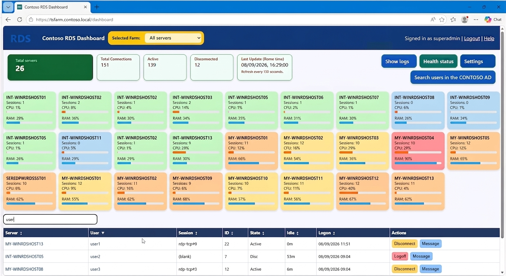
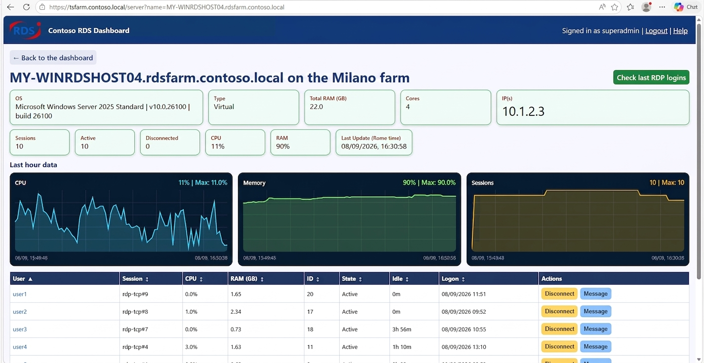
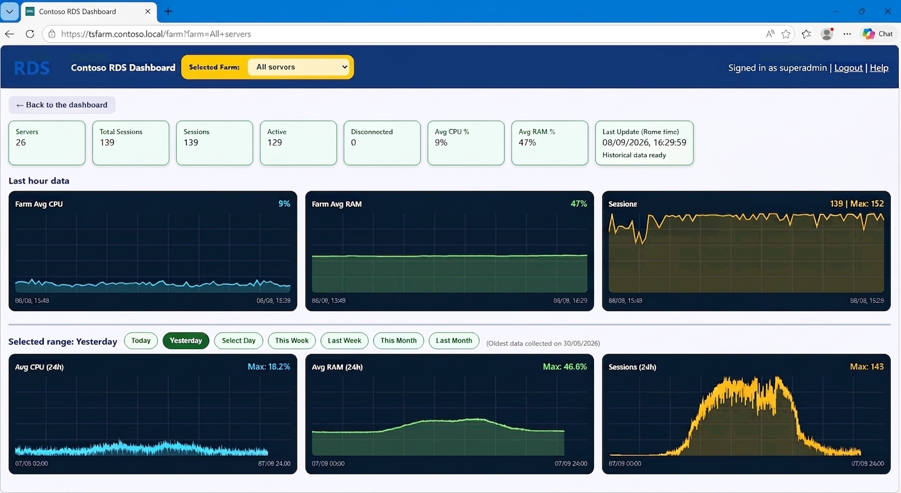

# RDS Dashboard Web App Guide

## Overview

The RDS-dashboard web app is a public domain program hosted at https://github.com/nicozanf/RDS_dashboard. It runs on Windows using native PowerShell/.NET components and standard Windows commands like `quser`. It does not need a
Web server, nor a proper installed database (it uses SQLite).

It was developed for managing isolated RDS hosts, where user balancing is accomplished outside the Microsoft servers using network appliances.
Because the usual Microsoft tools for managing RDS farms are not available, in this case you are totally blind without additional products.

Example screenshots:

the **main Dashboard**. Note the available submenu for looking at the logs, the Status, a peek at the Settings and searching Users on AD.
All the current sessions are listed and searchable.

the **single Host** view, with HW/SW details, users logged there and CPU/RAM/sessions history for the last hour.

the **full Farm** history view with CPU/RAM/sessions history for the last hour and for the last 60 days.

Points of interest:

- HTTPS on port 443
- AD form-based authentication (same domain as the server)
- Always-on mode via Windows Service
- Session actions: disconnect, logoff, send message
- Dashboard, server detail, and farm overview pages
- Farm trend history and latest live snapshot persisted in local SQLite
- SQLite persistence uses a single-writer model (collector only) with WAL + busy-timeout/retry lock hardening
- Collector server probes run in a reusable PowerShell runspace pool (replaces per-cycle Start-Job spawning)
- Snapshot reads use in-memory cache with hit/miss telemetry to reduce repeated JSON parse cost
- Session and in-memory history writes are guarded by explicit monitor locks
- Data refresh cadence is cycle-based: a new cycle starts after the previous full collection cycle finishes (or times out), then sleeps for `CycleDelaySeconds`

For prerequisites, offline dependencies, first-time setup, and validation, see [INSTALL.md](docs/INSTALL.md).

For configuration details, see [CONFIG.md](docs/CONFIG.md).

For API endpoints, security and troubleshooting, see [API.md](docs/API.md).

For AI agents guides, see [AGENTS.md](docs/AGENTS.md).

## Folder Contents

- `webapp/`: application directory
  - `server.ps1`: HTTPS web server, authentication, routes, UI rendering
  - `collector.ps1`: background data collector for RDS sessions and server load
  - `setup_https_443.ps1`: certificate + SSL binding + URL ACL setup
  - `install_service.ps1`: Windows service creation/recreation script
  - `run_webapp.cmd`: foreground launcher for manual testing
  - `config-example.toml`: tracked configuration template; see [CONFIG.md](CONFIG.md) for local configuration
  - `PrePublish-Scan.ps1`: scans source and documentation for likely secrets and internal identifiers before publishing
  - `test-farm.ps1`: prompts for dashboard credentials and runs the standard deployment health checks
  - `Test-HealthEndpoints.ps1`: runs authenticated API and persistence health checks against a dashboard URL
  - `logo-generic.png`: tracked public RDS logo used when no local company logo is available
  - `logo-company.png`: optional local company logo override; intentionally ignored by Git
  - `runtime/`: runtime data
    - `farm_metrics.sqlite`: persisted farm and per-server metric history
  - `logs/`: service and collector logs
    - `server.log`: service/runtime log
      - Includes snapshot cache telemetry lines (`Snapshot cache stats: hits=... misses=... hitRate=...`)
    - `collector.log`: collector loop log
      - Includes periodic performance telemetry (`PERF: cycles=... avg=... p50=... p95=... sqliteRetries=...`)
    - `connection_actions.log`: audit log for login/session actions/service lifecycle

## License

This project is licensed under the [MIT License](LICENSE).
